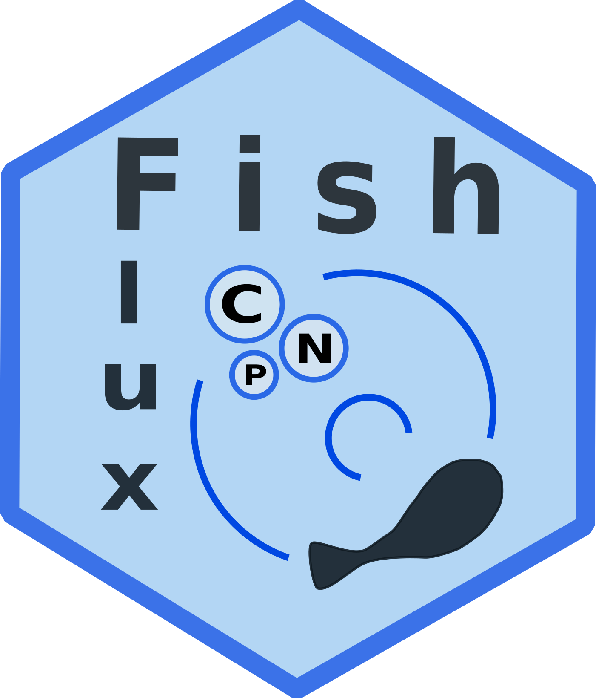

fishflux: A tool to model nutrient fluxes in fish
=================================================

[](https://travis-ci.org/nschiett/fishflux)



Overview
--------

The `fishflux` package provides a tool to model fluxes of C (carbon), N (nitrogen) and P (phosphorus) in fishes. It combines basic principles from elemental stoichiometry and metabolic theory. The package offers a user-friendly interface to apply the model. `fishflux` is ideal for fish ecologists wishing to predict ingestion, egestion and excretion to study fluxes of nutrients and energy. 

Main assets:
  
- Provides function to model fluxes of Carbon, Nitrogen and Phosphorus for fishes
- Allows for the estimation of uncertainty, dpending on the uncertainy of the input parameters
- Provides some functions to help find parameters as inputs for the model
- Provides functions to extract and illustrate results


Theoretical framework
---------------------

For more information on the theoretical framework behind `cnp_model`,
check out the paper (add link to paper).

Installing and loading fishflux
-------------------------------
First, make sure your R version is 3.4 or higher. Further, `fishflux` uses Markov Chain Monte Carlo simulations provided by
[stan](https://github.com/stan-dev/rstan/wiki/RStan-Getting-Started).
Therefore, the first step is to install
[rstan](https://github.com/stan-dev/rstan/wiki/RStan-Getting-Started). It's important to closely follow all the steps described on the page depending on your operating system, because rstan requires a functioning C++ compiler. Furthermore, `fishflux` depends on the package `rstantools` version 2.0.0 or higher. This means that if you already have an older version of `rstantools` installed, you will have to reinstall it, prior to the installation of `fishflux`.

### GitHub

Once you have your c++ compiler set up correctly, the best way to install the latest version of `fishflux` is to install it from GitHub.

``` r
install.packages("devtools")
devtools::install_github("nschiett/fishflux", dependencies=TRUE)
library(fishflux)
```

### CRAN

`fishflux` will be available on CRAN in the future:

``` r
install.packages("fishflux")
library(fishflux)
```

### Downloaded package file

Another option is to download the source file available on github
[here](https://github.com/nschiett/fishflux).

``` r
install.packages(path_to_fishflux_file, repos = NULL, type="source")
library(fishflux)
```

Documentation
-------------

See package [vignette](https://nschiett.github.io/fishflux/articles/intro_to_fishflux.html) for an introduction and help pages.

Citation
--------


